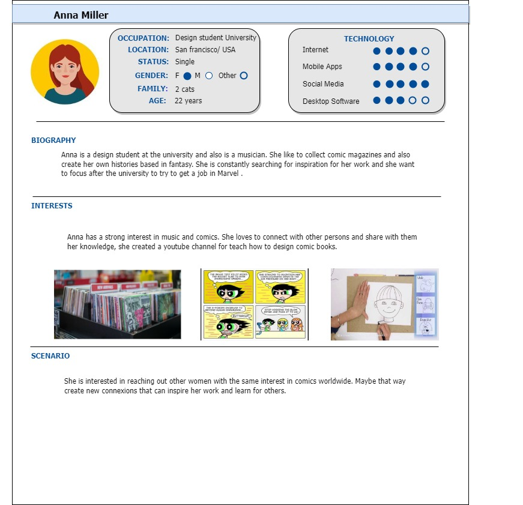
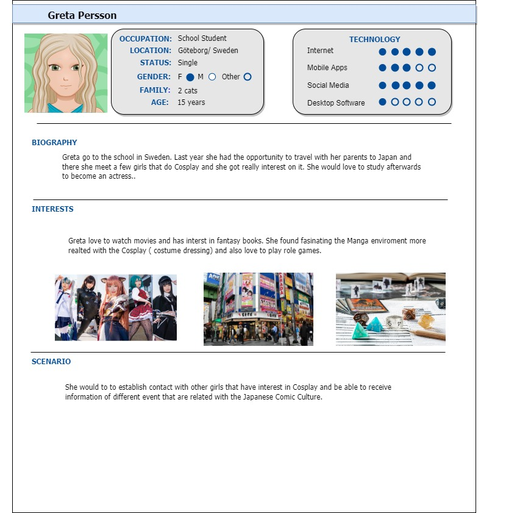
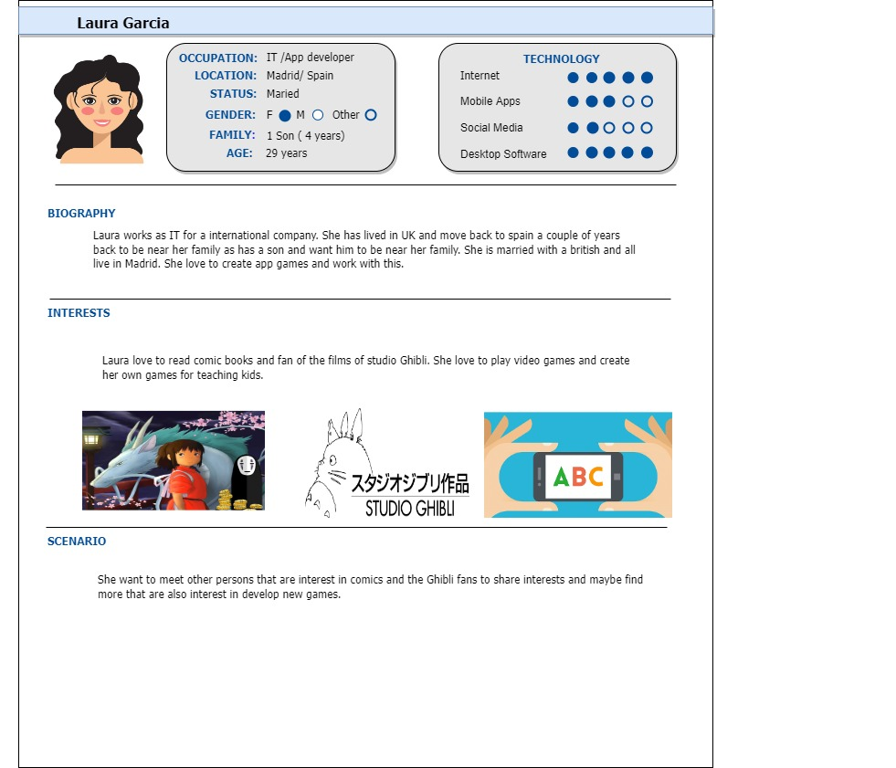
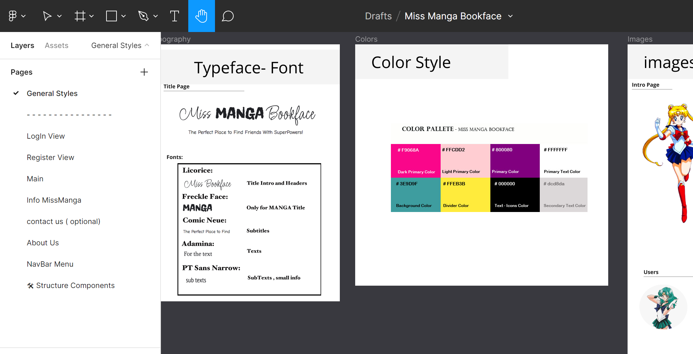
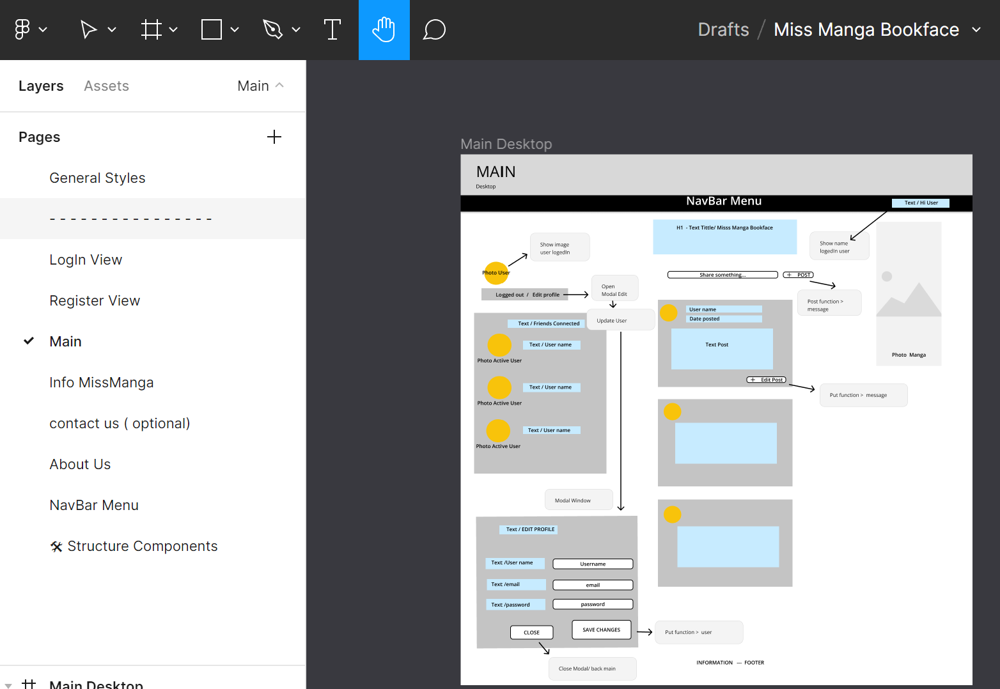
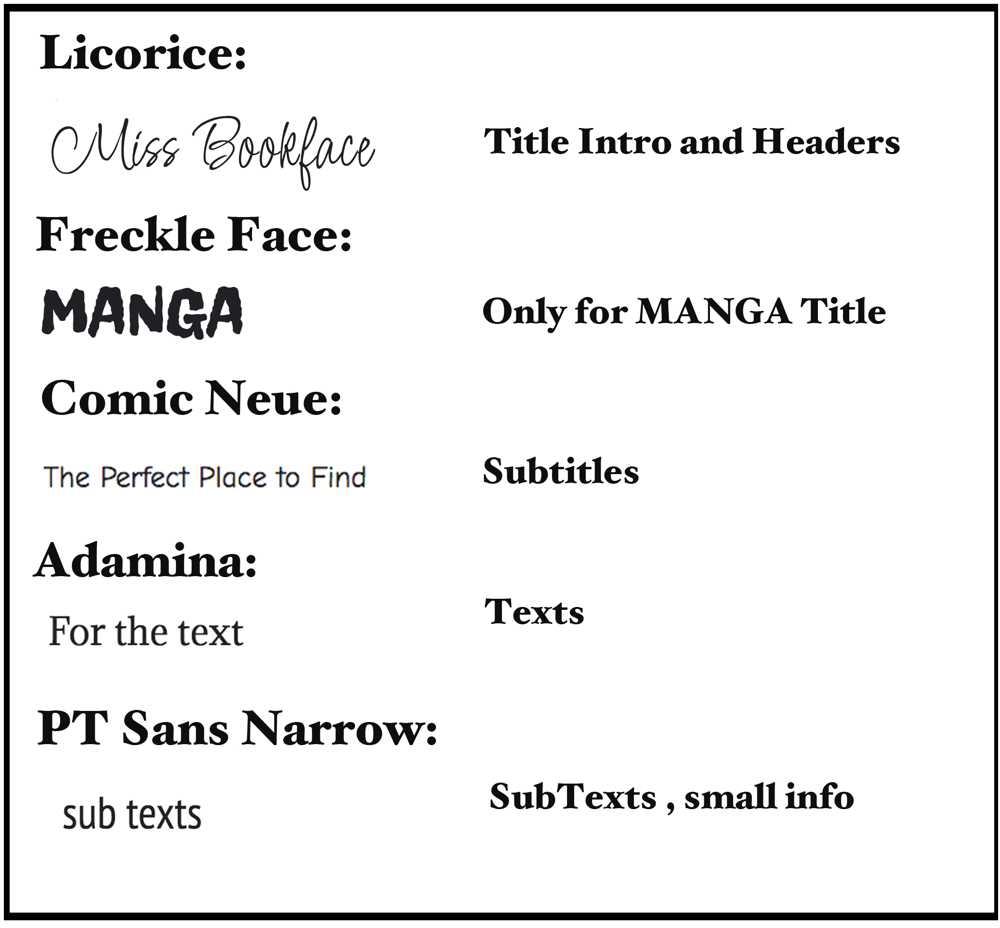
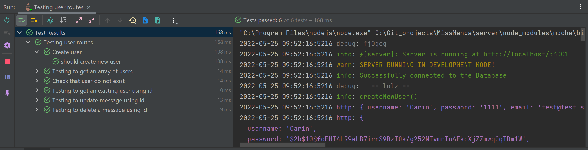
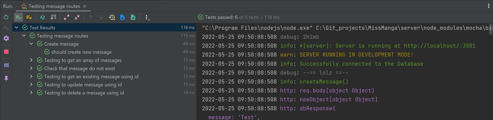
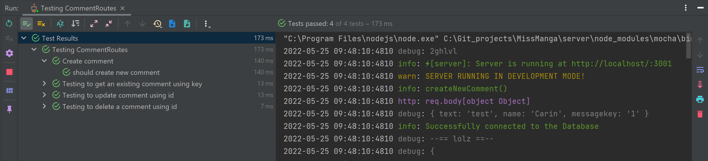
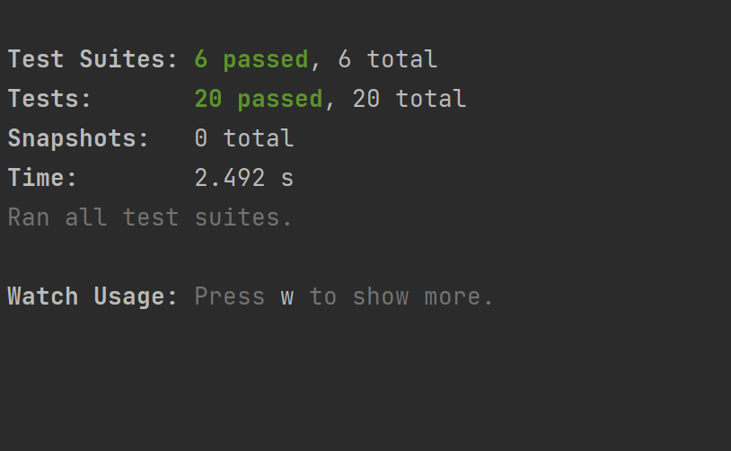

### The project individual documentation can be found in the folder:

### 📄 [Detailed Individual Info](./Dokumentation/UrsulaDoc.md)

---

### June 2022


# Fullstack Project: MissMangaBookFace

## Project work by _Carin Wood, Christoffer Knaving, Samantha Theerawat, Ursula Vallejo Janne_

---

### 📚 Table of Contents:

- [1. General Project Plan](#1-general-project-plan)
- [2. Personas](#2-personas)
- [3. Wireframes (Mobile, Tablet & Desktop)](#3-wireframes-mobile-tablet--desktop)

  - [UI and UX](#ui-and-ux)

- [4. Fonts](#4-fonts)
- [5. Color Scheme](#5-color-scheme)
- [6. Project Implementation](#6-project-implementation)

  - [ Functionality Overview ](#functionality-overview)
  - [ Testing ](#testing)
  - [ New Concepts ](#new-concepts)
  - [ Challenges ](#challenges)
  - [ Conclusion ](#conclusion)

---

## 1. General Project Plan

This Fullstack project involved building a backend connected to **MongoDB**, and from there, developing a frontend version of "BookFace" using **React**.

The planning process was managed through a Trello board, where all tasks were broken down into clear steps:

🔗 [Trello Project Board](https://trello.com/invite/b/e33HvTu4/a377d7edde9fe517ee789e0362e7a304/bookface)

Each folder includes a README explaining the packages used. Here’s a summary:

### Required installations:

```bash
# BACKEND
cd server
npm init -y
npm install express
npm install -D nodemon
npm install --save-dev typescript ts-node-dev @types/express @types/node
npm install cors dotenv helmet mongoose mocha morgan winston
npm install --save-dev @types/* for all dependencies
npm install bcrypt @types/bcrypt

# FRONTEND
npx create-react-app client --template typescript
npm install axios
npm install react-router-dom@6 @types/react-router-dom
npm install react-icons tachyons
```

---

## 2. Personas

Our main target group for BookFace is **women aged 15–30** with a shared interest in **manga/comics**. The idea is to offer a safe, female-only space for friendship, not dating.

We created user personas to guide the design process:





---

## 3. Wireframes (Mobile, Tablet & Desktop)

Wireframes were created in **Figma** and structured per screen and device:

🔗 [Figma Prototype](https://www.figma.com/file/wA043HDhQpEwBM8DhTxEy7/Miss-Manga-Bookface?node-id=802%3A7804)

[](./imgDoku/figmaGeneral.png)
[](./imgDoku/figma1.png)

---

### UI and UX

The design was inspired by **Sailor Moon**, reflecting a feminine, manga-themed aesthetic.

- The logo mixes a handwritten font with a manga-style one to match our audience.
- The project includes pages like:

  - **Info MissManga** – explaining the concept.
  - **Contact Us** – contact form.
  - **About Us** – team info.
  - **Main (wall)** – visible only after login.
  - **Login/Register** – entry point with forms.

Buttons were designed in contrasting colors to guide the user flow clearly.

---

## 4. Fonts

Fonts were chosen to reflect handwriting and manga styles:

- Licorice
- Freckle Face
- Comic Neue
- Adamina
- PT Sans Narrow



---

## 5. Color Scheme

The color palette was inspired by **Sailor Moon**, featuring vivid and contrasting colors with a teal base.


---

## 6. Project Implementation

We used **SCRUM methodology**, setting daily goals and splitting responsibilities.

### Functionality Overview

The main entities developed were:

- **Users**
- **Posts**
- **Comments**

Each with full CRUD functionality: GET, POST, PUT, DELETE.

---

### Testing

**Backend:**

- Tested with Insomnia and Mocha:

  - Users
    

  - Messages
    
  - Comments
    

**Frontend:**



---

### New Concepts

- First project using **TypeScript** for all team members.
- Implemented **bcrypt** for secure password hashing.

---

### Challenges

1. Coordinating group work and dividing tasks.
2. Limited experience with **GitHub collaboration** caused conflicts and data loss; we restarted once.
3. Issues with `.env` files in the backend.
4. Could not implement user image upload linked to IDs due to backend limitations.

---

### Conclusion

This project offered a real-world simulation of working in a development team with clear roles and structure. **SCRUM and Trello** were essential tools. We identified gaps in frontend-backend integration knowledge, especially in media handling and authentication workflows.
