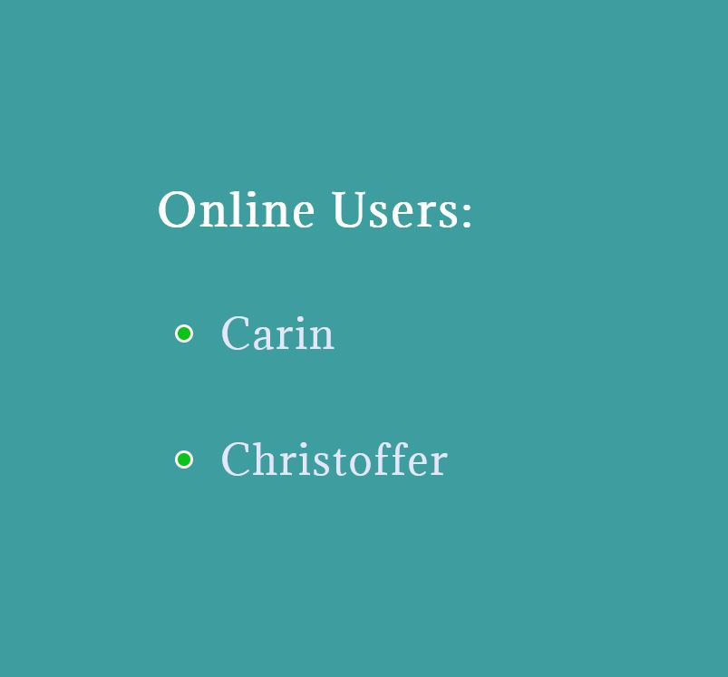

### Juni 2022
# FullStack Projekt: MissMangaBookFace
## Projektuppgift *Carin Wood*

## Projekt

Vi har arbetat med att bygga ett fullstackprojekt i grupp. Projektet har varit att göra en "Bookface". I vårt projekt kan man registrera en användare, logga in, skriva meddelanden, kommentera och uppdatera användaren. Planering har gjorts i [Trello](https://trello.com/invite/b/e33HvTu4/a377d7edde9fe517ee789e0362e7a304/bookface)

## Felsökning

De gånger jag har behövt felsöka har jag använt mig av console.log för att ta reda på hur koden körs och var det möjligtvis kan ha gått snett. Jag har också använt mig av metoden att jag har backat och byggt en liten bit i taget och få det att fungera för att sedan utöka koden i små steg.

## Exempel på min kod

Nedan följer en smart lösning på hur jag sett till att man inte kan ändra eller ta bort någon annans kommentar som man inte själv har skrivit. "user" innhåller användarens username som hämtats från localstorage. Det är det användarnamn som användaren loggat in med. Det jämförs här med namnet som registrerats när kommentaren skrevs. Om dessa namn sammafaller (user === item.name) så visas ikonerna för att kunna updatera och ta bort, är detta inte sant visas de inte. Detta med hjälp av en så kallad "short circuit".

```javascript

{user === item.name && <p className='delete-comment' onClick={() => deleteComment(item._id)}><FaRegTrashAlt className='trashcan'/></p>}
{user === item.name && <p className='edit-comment' onClick={() => openEditField(item._id, item.text)}><FaRegEdit className='trashcan'/></p>}

```

En rolig del i projektet var att jag lyckades göra en funktion som visade vilka användare som för tillfället är online. Funktionen nedan hämtar vilka användare i databasen som har "active": true. Alla som loggar in har true på denna boolean. Funktionen i backend skickar tillbaka dessa användare i en array som jag sparar i variabeln onlineUsers

```javascript

 const getOnlineUsers = () => {
      UserService.getOnlineUsers()
      .then(res => {
       setOnlineUsers(res.data)
       
      })
      .catch(error => console.log(error))
  }

```

Sedan "mappas" dessa ut på webbsidan... 

```javascript

  {onlineUsers.map(user => (
                <div  className='online-username-div'>
                <p className='green-dot'></p>
                <p className='online-username' data-testid='dbResponse'>{user.username}</p>
                </div>
            ))}

```

och resultatet ser ut så här: 



## Vad har jag lärt mig?

Jag har fått en inblick i hur svårt det är när flera stycken arbetar på samma projekt. För att få ett grupparbete att fungera optimalt krävs en stark ledare som har översikt över hela projektet och fördelar arbetsuppgifterna, annars kan det bli en aning rörigt och man vet inte vem som arbetar med vad.

Jag har användt de kunskaper som jag fått under utbildningen och sammanfört allt jag lärt mig i ett enda projekt. 

## Vad har varit svårt

En stor utmaning har varit att hantera projektet i Git. Vid ett tillfälle fungerade ingenting och vi fick skapa om projektet i Git. Sedan dess har vi varit noga med hur vi pushar och arbetar i olika branches som sedan raderas när man är färdig med dem.

## Vad har varit lätt

Själva genomförandet av projektet vad gäller skrivandet av kod har i sig varit ganska lätt. Svårigheterna har legat i att få alla delar att fungera ihop då olika personer har gjort de olika delarna.

## Något som var besvärligt att få till / varför jag bytte lösning

Det jobbigaste som jag stötte på i projektet var att lägg in och hämta en profilbild som skulle tillhöra användaren. Jag fick ut URL:en från backend till frontend, men det fungerade inte när jag skulle sätta den i en variabel och använda den.

## Lösningar jag valde att inte implementera

På grund av ovanstående problem, tog ett gemensamt beslut i teamet att skippa profilbild då det inte var avgörande för betyget.

## Framtida möjligheter

Jag känner att jag kan hantera alla delar i ett fullstack projekt och har fått en säkerhet i uppbyggandet av ett projekt. Vidare känner jag mig mer säker på hur man hanterar git. Detta är kunskaper jag kommer att ta med mig i mitt framtida yrkesliv som webbutvecklare.

## UX/UI

Webbsidan har många och starka färger. Dock tycker jag att det passar webbsidans tema. Manga, som är japansk teckningskonst, är full av glada färger och uttryck. Jag tycker att knappar och inputs är bra utformade för att det ska vara lätt för användaren att hitta på sidan.

## Utvärdering av projektet

Jag tycker att projektet har flutit på smidigt med tydliga sprintar där var och en vet vad man ska arbeta med.