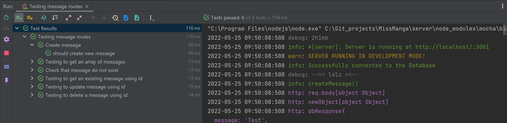

### Juni 2022


# FullStack Projekt: MissMangaBookFace
## Projektuppgift *Carin Wood, Christoffer Knaving, Samantha Theerawat, Ursula Vallejo Janne*


### Content Innehåller:

- [1. General Projektplan](#1-general-projektplan-)
- [2. Personas](#2-personas-)
- [3. Wireframes](#3-wireframes-mobiler-tablets-och-desktop-)
        - [UI och UX](#ui-och-ux)
- [4. Fonts](#4-fonts-)
- [5. Färgschema](#5-frgschema-)
- [6. Projektgenomförande](#3-projektgenomfrande-)
  - [ Funcionen i projekten ](#funcionen-i-projekten)
  - [ Tester](#tester)
  - [ Nya koncept ](#nya-koncept)
  - [ Svårigheter ](#svrigheter)
  - [ Konklusionen](#konklusionen)


# 1. General Projektplan :


I FullStack projektet består av flera delar, generera en backend med koppling med MONGO_DB och därifrån utveckla innehållet i en version av BookFace i REACT.

En del av projektet är att ha en projektutvecklingsplan vars beståndsdelar är nedbrutna i Trello.

Du kan se projektplan i länken nedan:

[Trello Webbsida ](https://trello.com/invite/b/e33HvTu4/a377d7edde9fe517ee789e0362e7a304/bookface)

Varje fil har en README där du kan se de olika paketen som installerades. Här är en sammanfattning:

## Installera följande npm paket i varan projekt:

```shell

BACKEND:
cd server
npm init -y
npm install 
npm install express 
npm install -D nodemon
npm i --save-dev typescript ts-node-dev @types/express @types/node
Middlewares:
npm i cors dotenv helmet mongoose mocha morgan winston
npm i -D @types/cors @types/dotenv @types/helmet @types/mongoose @types/mocha @types/morgan @types/winston
Tests:
npm i -D chai chai-http mocha ts-mocha ts-node @types/chai @types/chai-http @types/mocha @types/expect
Encryption:
npm i bcrypt
npm i --save -dev @types/bcrypt

   
FRONTEND:
   npx create-react-app client --template typescript
   npm install axios
   npm install react-router-dom@6
   npm i @types/react-router-dom
   npm install react-icons
   npm install tachyons@4.12.0
   
```
# 2. Personas :

För att utveckla projektet har vi beslutat att specificera en typ av användare som vårt förslag av BookFace.
Vi har haft idé att segmentera det till kvinnor mellan 15 och 30 år. Som har en gemensam smak som är mangaserier / comic. 
Ett exklusivt utrymme för dem där de bara får vänner, därför utesluter vi pojkar så att det inte finns något dejtingsätt.

För att utveckla projektet beaktas potentiella användares profiler. Vi har skapat personas om möjliga användare:


# 3. Wireframes (mobiler, tablets och desktop) :

Utvecklingen av Wireframes för projektet utvecklades i Figma. Där kan du hitta den segmenterade informationen för varje sida och de allmänna element som har implementerats i projektet. 
För detta vi inbjuder dig att se utvecklingen av detta i följande länk:

[PROTOTYP FIGMA PROJECT ](https://www.figma.com/file/wA043HDhQpEwBM8DhTxEy7/Miss-Manga-Bookface?node-id=802%3A7804)


[](./imgDoku/figmaGeneral.png)

[](./imgDoku/figma1.png)


### UI och UX:

För att utveckla projekten UI/UX baserar vi på informationen från Personas och inspirerad i Sailor Moon program.


- I rubriken som fungerar som sidans logotyp har vi blandat två typsnitt. En mer feminin (handskriven) och en serie för manga. Således är det konceptuellt kopplat till idén om allmänheten som vi vänder oss till: kvinnor med gemensam smak till den manga-komiska världen.


- Det beslutades i projektet att ha flera sidor som simulerar att vårt projekt är en riktig app, för vilken vi har inkluderat följande sidor:

* Info MissManga:
  Information om konceptet Miss Manga Bookface finns med här. Så det är tydligt för vem som besöker oss för vilken typ av publik vårt projekt riktar sig.

* Contact Us:
  Här finns ett kontaktformulär så att användare kan kontakta företaget.

* About Us:
  I det här avsnittet har vi beslutat att lägga informationen om gruppens medlemmar och vår kontaktinformation så att den kan fungera som en framtida referens och den som besöker den kan veta vem som har utvecklat projektet.

* Main:
 Denna delen kan endast synas om användaren har registrerat sig. Här är väggen där du kan se inläggen och kommentarerna. 
 På samma sätt finns en sektion för att kunna visualisera de användare som är aktiva.

* Logged In page / Register a new user:
  Det är ingångssidan till projektet där du hittar ett formulär för att identifiera dig eller för att registrera dig.

- Hela projektets layout har samma färg och tema för att skapa enhetlighet i innehåll och lika konceptuellt.

- Knapparna för att komma åt formulären och registrera valdes att göras i en kontrasterande färg så att processen som ska följas av användaren skulle vara tydlig.


# 4. Fonts :

För att utveckla hemsidan valde olika typer av typeface som har en style relaterad med Manga eller skrivstil.

Typeface vi valde var följande:

1. Licorice (title MissManga)
2. Freckle face (title MissManga)
3. Comic Neue (Layout)
4. Adamina (Layout)
5. PT Sans Narrow (Layout)

##Final Fonts :


# 5. Färgschema :

För att definiera en färgpalett har vi inspirerats av färgomfånget som används i Sailor Moon. I den dominerar kontrasterande färger med en stor tendens till levande färger. 
Färgen vi använder som bas är en blågrön ton som skapar en kontrast mot de andra elementen.

##Final Color Palette:


# 6. Projektgenomförande :

Sedan berättar vi processen att utveckla projektet.

## SCRUM:

I projektutvecklingsprocessen har vi följt Scrums riktlinjer. För detta har vi segmenterat projektet i delar och distribuerat det mellan oss för dess utveckling.

Vi har satt datum för varje process och vi har haft en daglig kommunikation så att alla medlemmar i gruppen vet i vilket tillstånd av utarbetande vi var, vilka svårigheter vi stötte på och de saker som vi såg längs vägen var platt att utveckla.

I denna process har en av medlemmarna i gruppen fyllt funktionen att samordna gruppen och hjälpa till att fördela arbetet och försöka följa varje utvecklingsstadium noggrant.

## Funktionen i projekten:

I projektet har vi utvecklat tre grundläggande delar i utvecklingen av projektets funktionalitet. 
För detta delar vi konceptuellt in det i tre segment: användare, inlägg och kommentarer.

I dessa tre segment har vi implementerat CRUD : GET, POST, PUT, DELETE; som vi har kontrollerat vid sömnlöshet och motsvarande tester.

## Tester:

I projektet har både frontend och backend testats, vilket vi kan se nedan:

* Backend:

  I Backend-mappen hittar du Insomnia-testfilen.

Test Insomnia:


Test backend:

- User:
  

- Messages:


- Comments:


* Frontend:


## Nya koncept:

I det här projektet har vi gjort det i Typescript som var ett nytt programmeringsspråk för alla medlemmar i gruppen.

Ett annat nytt element som vi har lärt oss är att använda Bcrypt för att hantera lösenordskryptering och hur man implementerar det i vårt projekt.


## Svårigheter:

1.Den första svårigheten vi hade när vi stod inför projektet var hur man skulle överväga hur man skulle arbeta tillsammans och hur man delar upp delarna till var och en för dess utveckling.
I slutet har vi tittat närmare på den information som krävdes för projektet och vi implementerade SCRUM för att kunna gå efter delar. Hittade vi också en konsensus om styrkorna som var och en hade i gruppen och komplettera den med hjälp av andra för att genomföra projektet.

2.Ett hinder som vi har haft är när vi använder GITHUB att vi inte har så mycket erfarenhet av att arbeta med det i grupp. Vi har behövt mer förtydligande från vår lärare och trots det har vi haft problemet att vi har tappat den information som vi hade genererat i projektet på grund av konflikter i hur vi hanterat informationen på denna plattform, varför vi var tvungna att starta ett projekt igen från noll.

3. I Backend-delen har vi haft flera problem med .env som inte tillät oss att öppna projektet. En sak som hände flera gånger i den här processen som gav oss ett fel när vi startade den.

4. Vi har haft svårt att kunna länka en bild till ett användar-id. Vi fick höra att detta inte skulle spara minne i den externa databasen men vi kunde inte lösa det, så i slutet av att prova det på olika sätt valde vi att inte implementera det. Vi anser att vi för frontend saknade lite för att kunna se den här typen av innehåll i klassen när det är relaterat till en databas i backend.


## Konklusionen

Projektet har verkat intressant för oss eftersom det är en mer verklig approximation till vad som skulle kunna vara en arbetsmiljö där flera personer samarbetar i ett projekt och ska följa en viss parameter och struktur. För detta hjälpte SCRUM och Trellos hjälp oss mycket.

Vi hade gärna haft en mer detaljerad förklaring av hur implementeringen gjordes korrekt i frontend-delen och hur den skiljde sig från en projekt inte delat informationen med backend.

Andra delen vi ser att vissa aspekter som användningen av kryptering och hanteringen av bilder som är relaterade till exempelvis ett id för databasen/backend, kunde vi ha sett lite mer detaljerat under hela kursen, innan vi nådde utarbetandet av projektet.

