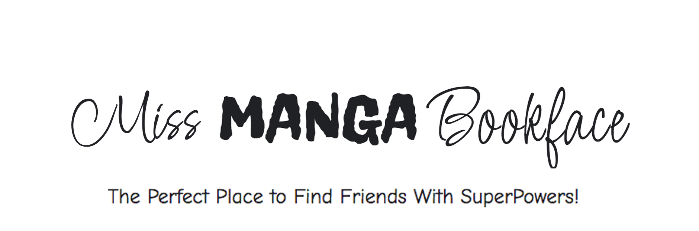
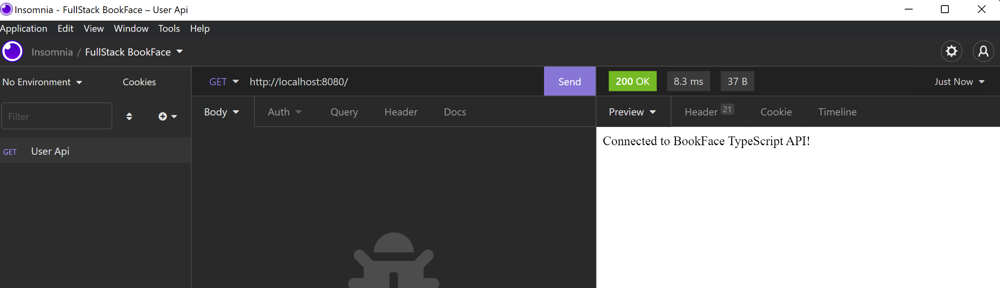

### Juni 2022
# FullStack Projekt: MissMangaBookFace
## Projektuppgift *Ursula Vallejo Janne*

## Projekt

Projektet föreslås göras i grupp och omsätta vår kunskap om Fullstack i praktiken en BookFace Projekt.
Tanken är att genomföra en databas till en backend med tillhörande API som vi kopplar till frontend med react ( tester på : client och server). Detta ska göras med hjälp av Docker, Node.js, MongoDB, Mongoose och React.js med Typescript

En viktig del av projektet har också varit implementeringen av de projekt genomförandekoncept som används i SCRUM.
I det här avsnittet har vi valt att en i gruppen ska ta på sig rollen att samordna de uppgifter som ska utföras och övervaka varje steg i projektet.
Jag har haft denna roll för att kunna hjälpa till att hantera de olika aspekterna av projektet på ett tydligt och effektivt sätt och för att kunna ha en bra koordination och kommunikation med teamet.

## Projektplanering:

För detta bryter vi ner alla krav som har ställts på oss och utvärderar vad vi behövde utveckla för att ha en tydlig vision om det arbete som ska göras.
Vi har gjorts det i Trello och här kommer länken: 

[Trello Webbsida ](https://trello.com/invite/b/e33HvTu4/a377d7edde9fe517ee789e0362e7a304/bookface)


## UX/UI

UX/UI-utvecklingssektionen har varit i min ledning, med feedback från arbetet med gruppen.

-För att utveckla projektet, skapa först en användargrupp som vi ska styra Bookface-projektet till. Så vi har valt kvinnor mellan 15 och 30 år.

-Skapande av användarprofiler: 3 personer som kan ses i den allmänna dokumentationen av projektet.

-Definiera inspirationen vi använder i projektet som vi förlitar oss på Sailor Moon som är Manga (japansk teckningskonst, är full av glada färger och uttryck). Mer detaljerad förklaring finns i gruppdokumentationen.

[](./imgDoku/sailormoonTheme.png)

-Definiera namnet som ska användas för MissManga Bookface och definiera logotypen som vi skulle implementera.

[](./imgDoku/title1.png)
[](./imgDoku/title2.png)

Det här var vad vi definierade att använda:

[](./imgDoku/TitleIntro.jpg)

- Gör en sökning på vilken typ av olika typer av Typeface som skulle kunna gå enligt projektet och gör en tabell över de Typeface som vi skulle implementera (diagram med photoshop och ladda ner dem och lägg till dem i projektet).

[](./imgDoku/fontTest.png)

- Skapa en färgpalett för projektet med kontrasterande och levande färger baserade på Sailor moon-temat.

[](./imgDoku/colorpalette.jpg)

-Med hjälp av Photoshop skapa ett första koncept av hur projektet skulle se ut:
[](./imgDoku/intropage.jpg)

-Hitta och redigera bilderna som ska användas i projektet.

-Skapa i Figma wireframes för projektet och de allmänna aspekterna att ta hänsyn till i utvecklingen av projektet som kan ses i följande länk:

[PROTOTYP FIGMA PROJECT ](https://www.figma.com/file/wA043HDhQpEwBM8DhTxEy7/Miss-Manga-Bookface?node-id=802%3A7804)

I de wireframes som jag har gjort i figma beskrivs aspekter som vilken typ av länkar som finns mellan knapparna och innehållet, samt vilka funktioner som måste skapas i backend.
CRUD-bas för de 3 grupperna som vi måste skapa: användare, meddelanden och kommentarer.
Även visualisering på olika plattformar som desktop, ipad och telefon.

[](./imgDoku/figmaView.png)

-Till sist har jag gjort justeringar av Figma och gjort den allmänna dokumentationen av projektet.


## Backend:

I denna del, hjälp initialt med att göra hela grunden att användas i servern: Middlewares, StatusCode, Server.ts,osv ..konfigurationer och ordningen på mapparna. Den första delen handlade om att skapa en anslutning för att visa att API är fungerade vid Insomnia:

[](./imgDoku/apiAlive.png)

I det här avsnittet har jag gjort delen som motsvarar användaren; modell, gränssnitt och den första delen av kontrollerna (skapa, getByID, ta bort).Och verifiera att dessa funktioner fungerade korrekt i Insomnia och de sågs korrekt i Mongo.

[](./imgDoku/user-api.png)

Felen kunde hanteras med hjälp av Logger vilket gjorde det lättare att se eventuella fel i terminalen.

## Frontend:

I Frontend-delen, hjälp till att generera de olika router som länkar till de olika sidorna, generera mallen med sidhuvudbilderna på varje sida. Även innehållet på de sidor där kontaktformuläret och informationen finns genomförs.

När man skapade rutterna fungerade det inte korrekt för när man startade projektet i Typescript gjordes ändringar som inte gjorde att det fungerade korrekt, så jag letade efter en lösning på webben och bad till slut läraren i klassen att kunna lös det.

I Main-sektionen försökte jag hjälpa till att lösa problemet med att matcha bilden i frontend med användar-id som vi hanterade i backend men till slut har vi inte implementerat det och jag kunde inte få det att fungera heller eftersom modellen jag hittade på webben var det inte det mest bekväma för att hantera bilder eftersom det sparade bilden i databasen vilket inte var det bekvämaste eftersom det i ett projekt med en större skala inte skulle optimera resurser och göra det långsamt att ladda användaren.

I den här console.log-delen eller direkt i inspektionsalternativet i DOM, visualisera de fel den behövde för att kunna lösa dem.

## Tester Frontend:

I Frontend-delen var jag ansvarig för att göra testerna. Jag har gjort 20 varav 5 med fireEvent.

När jag utförde testerna fann jag svårigheten att informationen för att generera testerna inte lästes på grund av ett problem med UseNavigate.

Till slut var det möjligt att lösa det med hjälp av min lärare, med följande som referens:

```javascript

import {fireEvent, render, shallow} from "@testing-library/react";
import OnlineUsers from "../onlineUsers/OnlineUsers";
import {BrowserRouter} from 'react-router-dom'


let getByTestId

beforeEach(() =>{
    const view =render(
        <BrowserRouter>
            <OnlineUsers/>
        </BrowserRouter>
    )
});


test('placeholder test', () => {

})
```


## Nya koncept:

I det här projektet kunde jag implementera Typescript i Backend, vilket var helt nytt för mig.

Ett annat koncept som var helt nytt var introduktionen av Bcrypt för lösenordshantering.

## Svårigheter:

De flesta av svårigheterna har jag redan nämnt i den allmänna dokumentationen, de kan jag syntetiseras med de frågor som uppstod under hela projektet:

* Hur man implementerar Scrum?
* Hur delar man upp projektet inom teamet?
* GIT orsakar oss problem när vi arbetar som ett team. Hur kan vi lösa det? Letar du efter lärarstöd och onlinematerial?
* Konflikter vid uppdatering av GIT på varje gruppmedlem. Hur löser man det? Slutlig lösning starta det från början.
* Hur genererar man gränssnittet och vilka modeller ska man generera i backend-projektet?
* Problem med .env att vi inte kunde starta serverprojektet.
* Hur vill vi strukturera informationen som syns i projektet? Vilken typ av interaktion vill vi ha?
* Hur hanterar man bilder med ett användar-ID? Hitta implementeringslösningar. Till slut bestämde vi oss för att inte göra det eftersom vi inte hittade något bra alternativ och vi tror att detta innehåll inte kommer att kunna synas i kursens innehåll.

## Konklusionen

Jag tycker att det har varit ett intressant projekt att genomföra eftersom det har hjälpt oss att simulera hur det skulle vara på arbetsplatsen att genomföra ett projekt när det genomförs i grupp.

På samma sätt har vi kunnat implementera de olika kunskaper som inhämtats under kursen och kunnat se vilka aspekter var och en har tydligare och vilka som fortfarande behöver fördjupas beroende på var och ens intressen. Personligen tycker jag att frontend och UX/UI-delen är mer intressant eftersom jag är en mer visuell person och jag tycker att det är en nyckelpunkt i interaktionen med användaren som kan göra den effektiv eller inte.
Backend-delen har jag lärt mig att förstå hur det hänger ihop med varandra och det är en kunskap som bidrar till att kunna förstå hur man genererar ett projekt.

Jag kanske hade velat ha spenderat mer tid på kursen för att kunna gå djupare in i hur man korrekt implementerar backend i frontend, speciellt när det är bilder och Kontaktformulär till exempel inblandade som är relaterade till varandra.


