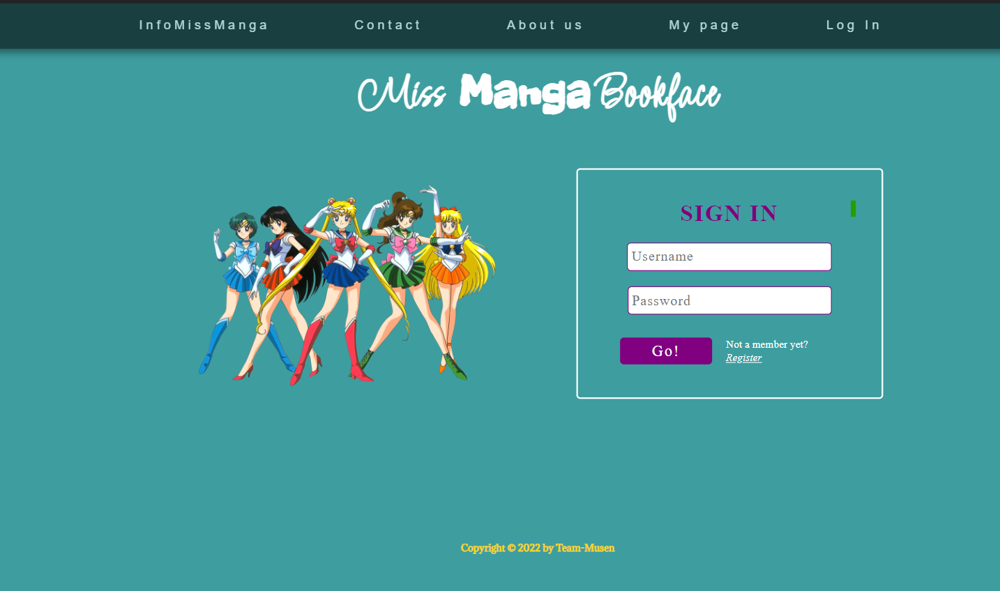
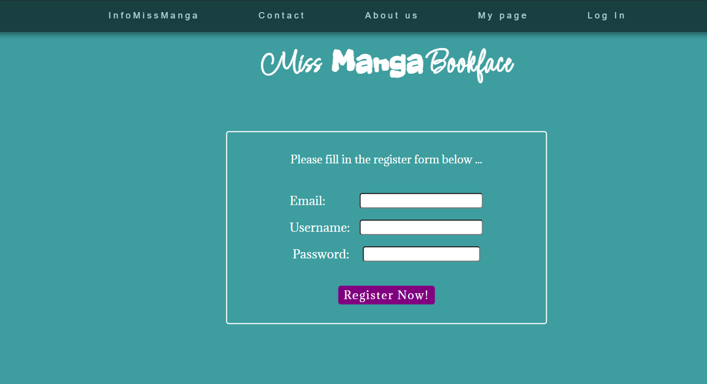
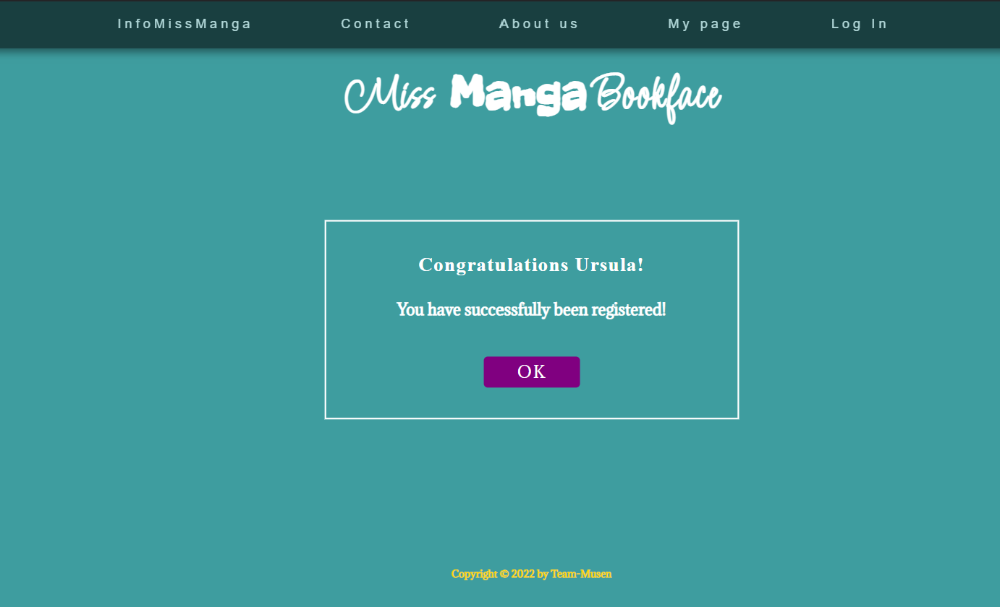
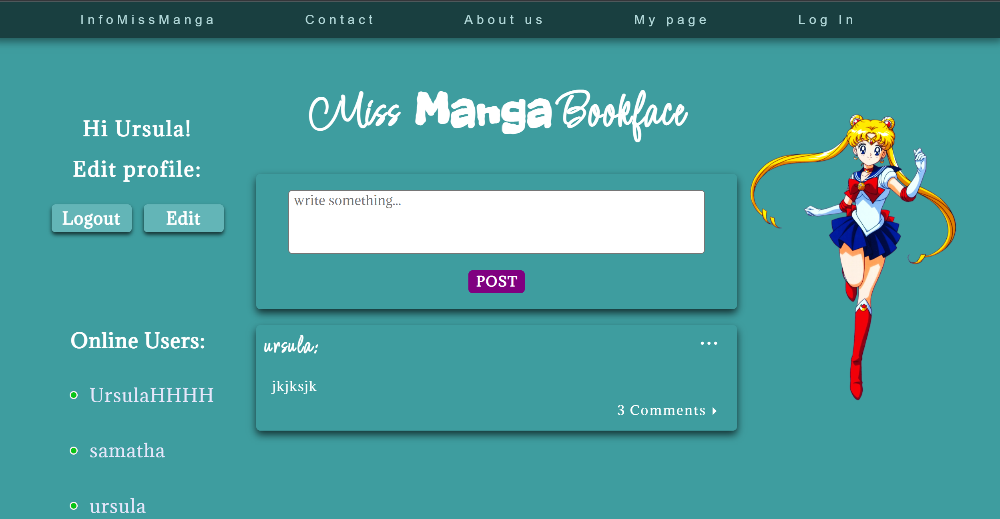
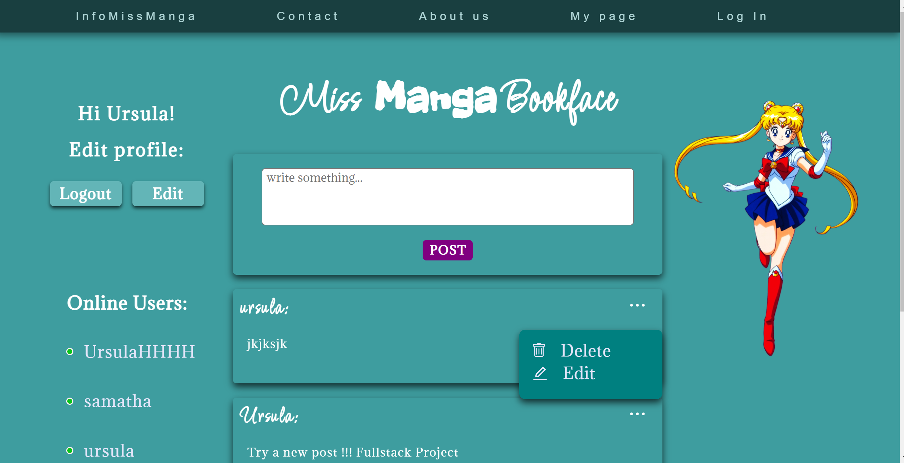
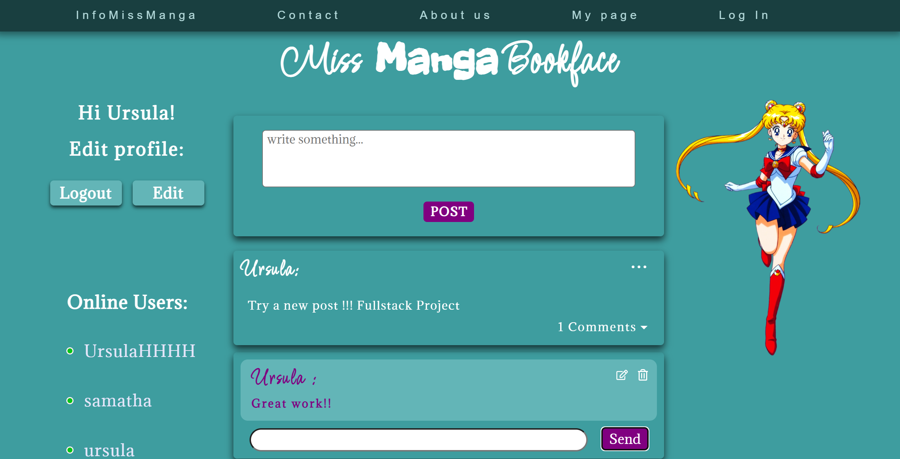

## MERN_Fullstack projekt > MissManga BookFace

**Project Summary**

In this project, we built "Bookface" – a social platform where users can register, log in, post messages, comment, and update their profiles. Passwords are securely encrypted in the database, and login is required to access and interact with the content. The project was developed as part of the Webbutvecklare program at Campus Mölndal, by Carin Wood, Christoffer Knaving, Samantha Theerawat, and Ursula Vallejo.

> Generate a backend with connection with MONGO_DB and from there develop the content in a version of BookFace in REACT ( Frontend).

---

## 🛠️ Technologies Used

🖥️ Client (Frontend)
React – Frontend library for building user interfaces.

React Router DOM – Client-side routing.

Axios – HTTP client for API requests.

Tachyons – Utility-first CSS framework.

React Icons – Icon library.

🗄️ Server (Backend)
Node.js + Express – Web server and API routing.

MongoDB + Mongoose – NoSQL database and ODM for data modeling.

TypeScript – Strongly typed JavaScript for better maintainability.

Helmet – Security middleware for Express.

Winston & Morgan – Logging tools.

dotenv – Environment variable management.

Mocha + Chai – Testing framework and assertions.

---

## General View

https://user-images.githubusercontent.com/89070768/207894673-ad94f663-012d-4509-b3be-c8b64371140a.mp4













---

### 🚀 How to Run the Project Locally :

1. **Clone or download** the project folder

```bash
   git clone <your-repo-url>
   cd <project-folder>
```

2. **run the development server** Client and server

```bash
npm start

```

### 📄 [Detailed Information of the Project](Detail_Info.md)
